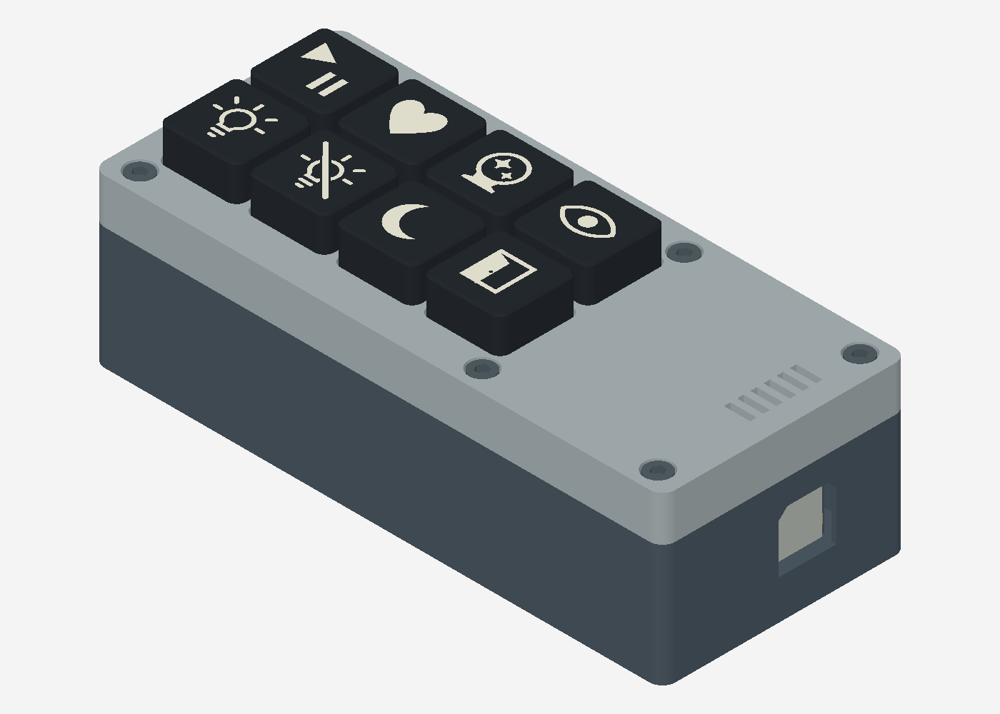

# ESP Station

A USB-powered ESP32-C5 station with CO₂, temperature/humidity, radar presence,
and eight mechanical buttons. Firmware publishes MQTT telemetry and Home
Assistant discovery over TLS. Button events contain GPIO identifiers; assign
actions in your own automation system.



## Bill of materials

| Part | Quantity |
| --- | ---: |
| Seeed Studio XIAO ESP32-C5, with antenna | 1 |
| Sensirion SCD4x CO₂ sensor breakout, 3.3 V I²C | 1 |
| Hi-Link LD2410C radar module | 1 |
| MX-compatible mechanical switches | 8 |
| USB-C cable, hookup wire and sensor connectors | 1 set |
| Printed base, lid, switch plate, three electronics carriers and eight keycaps | 1 set |

## Firmware

Use ESP-IDF **6.0.2**. Add your broker's public CA certificate as
`firmware/main/certs/mqtt_ca.crt`, then run from an ESP-IDF terminal:

```sh
cd firmware
idf.py set-target esp32c5
idf.py menuconfig
idf.py build
idf.py -p PORT flash
python tools/provision.py --port PORT wifi
python tools/provision.py --port PORT mqtt
```

Replace `PORT` with the board's USB serial port. Setup prompts for credentials;
passwords are hidden and saved only in the device's encrypted NVS. First boot
provisions an HMAC key in eFuse KEY0. See [wiring and firmware details](firmware/README.md).

## Models and printing

Editable FreeCAD models are in [`models/`](models/). Bambu Studio projects are in
[`print/`](print/):

- `01_Enclosure_and_Mounts_0.4mm.3mf`: base, lid, switch plate, ESP32 carrier,
  CO₂ carrier and radar carrier together on one plate.
- `02_Keycaps_AMS_0.2mm.3mf`: twelve distinct icons on one plate, with
  identical 18 × 18 × 9 mm bodies, white PLA and black inlays.

The enclosure plate uses a 0.4 mm nozzle. The keycap plate uses a 0.2 mm nozzle
and AMS. Select any eight icons for the station.

The icons are bulb, crossed bulb, moon, door, start/pause, heart, crystal ball,
eye, solid triangle, solid square, solid circle and arrow-door. Each icon appears
once in the [editable model and print project](models/README.md). Only the icon
differs; the outer profile and switch socket are shared by every cap.

Open the 3MF in Bambu Studio, select your printer/filaments and slice before
printing. Models retain their native editable features. The enclosure is
130 × 56 × 38 mm, excluding keycap height.

**Design limitation:** the base's top-open nut pockets do not capture the nuts
vertically, so the screw-fastened lid can lift out with them. Add a suitable
retention method before relying on the enclosure closure.

## License

Original firmware, tools and documentation: [MIT](LICENSES/MIT.txt).
Models, print projects and preview images: [CC0-1.0](LICENSES/CC0-1.0.txt).
Vendored sensor driver code retains its [third-party license](THIRD_PARTY.md).
