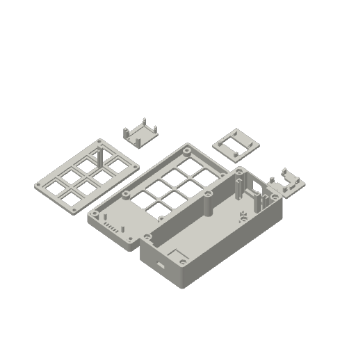

# Models and printing

Open `Station.FCStd` in FreeCAD 1.1 for the base, lid, switch plate and carriers.
Open `Keycaps.FCStd` for the twelve keycaps. Each named icon group contains its
native editable body, sketches and inlays. The station document's eight keycaps
are assembly references. Editing CAD does not automatically update the saved 3MF.

## Keycaps

`../print/02_Keycaps_AMS_0.2mm.3mf` contains one of each icon on a single plate.
Every cap has the same 18 × 18 × 9 mm outer profile, skirt and MX socket.

| Plate row, front to back | Icons, left to right |
| --- | --- |
| 1 | Bulb, crossed bulb, moon, door |
| 2 | Start/pause, heart, crystal ball, eye |
| 3 | Solid triangle, solid square, solid circle, arrow-door |

Use the A1 0.2 mm nozzle, 0.10 mm layers, four walls, 20% gyroid, no supports or
object brim, and a prime tower. Keep the face-down orientation. Slot 1 is white
PLA; slot 2 is black PLA for the 0.52 mm deep inlays. Colour-change purge volumes
are 172 mm³ white to black and 652 mm³ black to white. Select the eight icons you
want, or print all twelve.

## Enclosure and mounts

The base, lid, switch plate and all three electronics carriers share one plate in
`../print/01_Enclosure_and_Mounts_0.4mm.3mf`: 0.16 mm layers, four walls,
20% gyroid, and no support or brim. Keep the stored orientations.

Both projects have been sliced and reopened through Bambu Studio's CLI. Desktop
preset persistence has not been checked. On opening, confirm the nozzle, layer
height, walls, infill, supports, brim and filament slots above before printing.

The base has open nut pockets without vertical capture. Its lid needs an added
retention method. Test switch socket and carrier fit with your hardware; fit and
material performance depend on the printer and electronics breakout.
